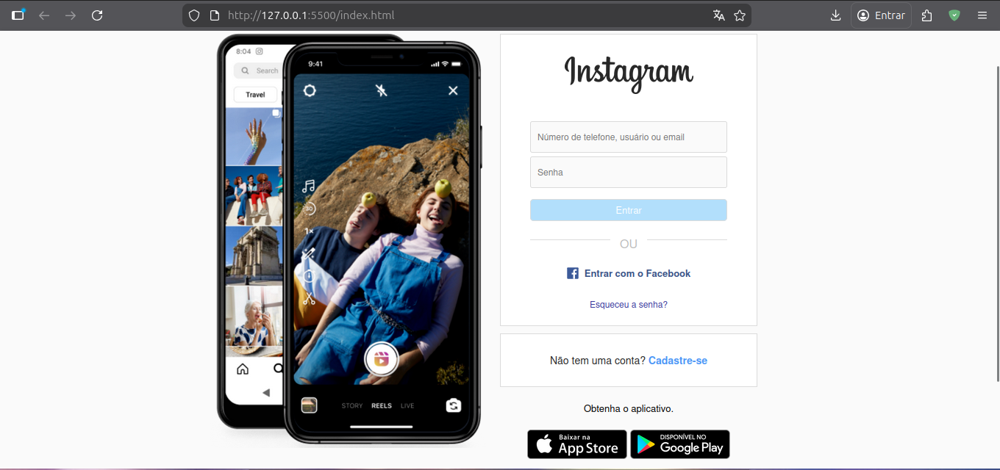
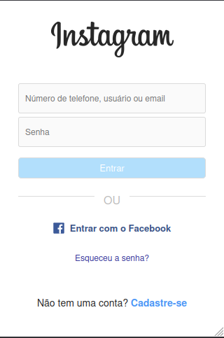

# Instagram Login Page

This project is a replica of the Instagram login page, created solely for educational and non-profit purposes.

## Technologies Used

- **HTML5**: Used to structure the page content with semantic elements such as `<main>`, `<footer>`, and `<nav>`. The form uses modern input types for better user experience and accessibility.

- **CSS3**: Responsible for all visual styling and layout, including:
  - **Flexbox**: Used extensively for layout alignment and distribution (main container, footer links, Facebook login button)
  - **Media Queries**: Implements responsive design that adapts to mobile devices (max-width: 450px), hiding the banner and adjusting element widths
  - **Custom Styling**: Replicates Instagram's visual identity with specific colors, borders, border-radius, and spacing
  - **Positioning**: Absolute positioning for the separator text element
  - **Box Model**: Uses `box-sizing: border-box` for consistent sizing across all elements

## Project Structure

```bash
.
├── assets
│   ├── css
│   │   └── styles.css
│   └── img
│       ├── apple_btn.png
│       ├── banner2.png
│       ├── favicon.png
│       ├── gplay_btn.png
│       ├── logo_facebook.svg
│       └── logo_instagram.png
├── index.html
└── README.md
```

## How to Run

1. Clone this repository to your local machine:

   ```bash
   git clone git@github.com:alexandrerogeriosn93/project-html-css-instagram-login-page.git
   ```

2. Navigate to the project folder.
3. Open the `index.html` file in your preferred web browser, or use the [Live Server](https://marketplace.visualstudio.com/items?itemName=ritwickdey.LiveServer) extension in VS Code for a better development experience with auto-reload.

## Preview

### Desktop



### Mobile



## Disclaimer

This project is a replica created for educational and non-profit purposes only. All rights regarding the brand and visual identity belong to Instagram/Meta.
